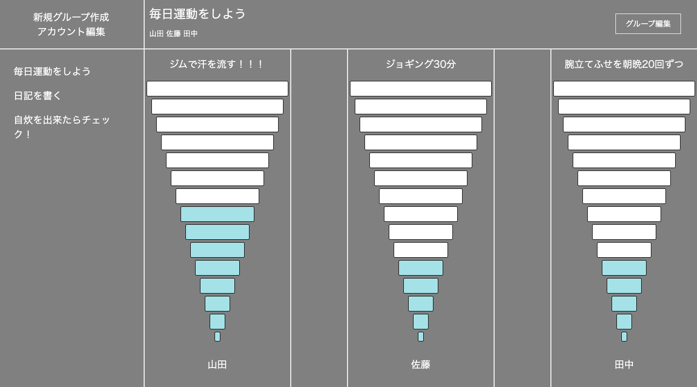
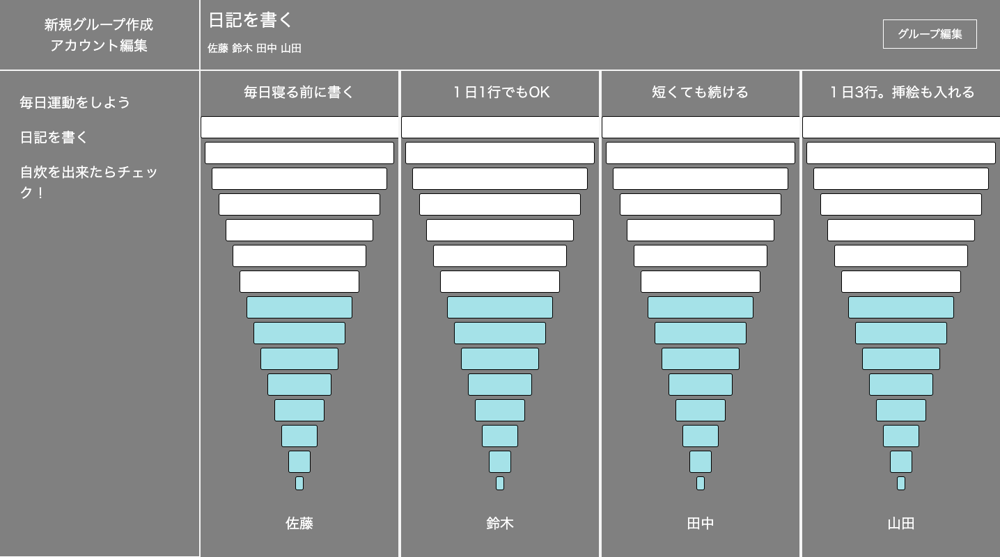

## :tada: Name
### Target

## :pencil2: Overview
### 自分と他者の目標達成を比較できるアプリケーション
一つのグループの中で、各人が目標(Target)を設定し、達成したらカウントを上昇させる。

## :mag_right: Production background
### 三日坊主を防ぐため。自己評価をするため。

一般的なToDoアプリは、自らの継続しか記録が出来ない。  
それでは、２つ課題があると感じていた。  
一つは、個人の意志に依存するため三日坊主に繋がりやすいこと。  
二つめは、自分の努力を客観的に評価が出来ないこと。

そこで他者とToDoを共有出来れば、上記課題を解決出来るのではと考えた。  
例えば仲間の努力を見て、自分も頑張ろうと思い、三日坊主を乗り越えられる。  
また他者の目標と比較をすることで、自らの努力を客観的に評価し、軌道修正が出来るなど。  

以上の想いから、Targetを製作した。  

## :camera: Demo

## :dizzy: Future plans
カウンター内部か横に、数値を表示する。  
カウンターが一番上まで来たら、"おめでとうメッセージ"などを表示する。  
クリックだけでなく、スライドでも、カウンターの色を変えられるようにする。  

## :globe_with_meridians: DB
### usersテーブル

|Column|Type|Options|
|------|----|-------|
|user_name|string|null: false|
|email|string|null: false, unique: true|
|password|string|null: false, unique: true|

#### Association
- has_many :groups_users
- has_many :groups, through: :groups_users
- has_many :targets

### groupsテーブル

|Column|Type|Options|
|------|----|-------|
|group_name|string|null: false|

#### Association
- has_many :groups_users
- has_many :users, through: :groups_users
- has_many :targets

### group_usersテーブル

|Column|Type|Options|
|------|----|-------|
|groups_id|integer|foreign_key: true, null: false|
|user_id|integer|foreign_key: true, null: false|

#### Association
- belong_to  :user
- belong_to :group

### targetersテーブル

|Column|Type|Options|
|------|----|-------|
|targeter_name|string|null: false|
|counts|integer|null: false|
|user_id|integer|foreign_key: true, null: false|
|groups_id|integer|foreign_key: true, null: false|

#### Association
- belong_to :user
- belong_to :group
